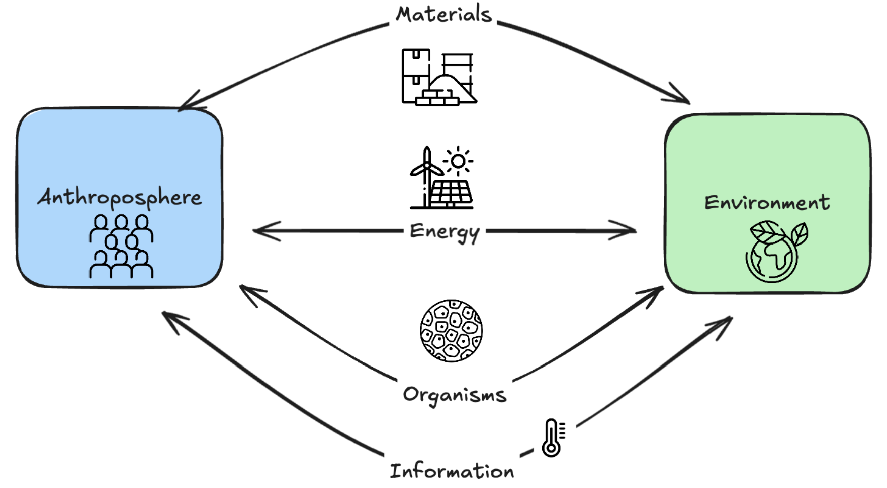
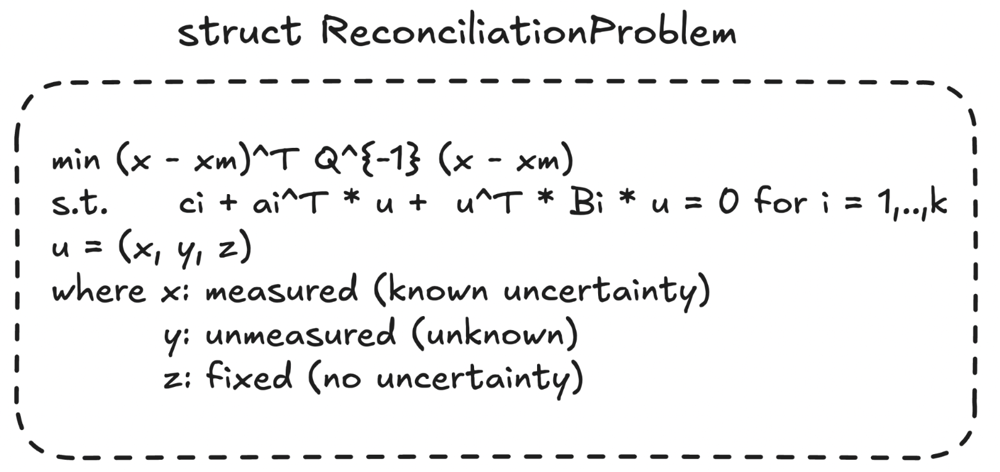
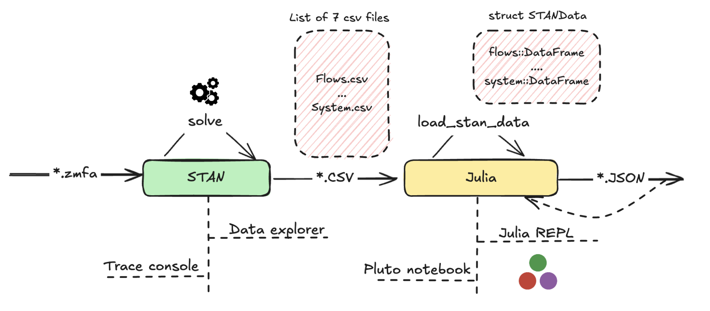
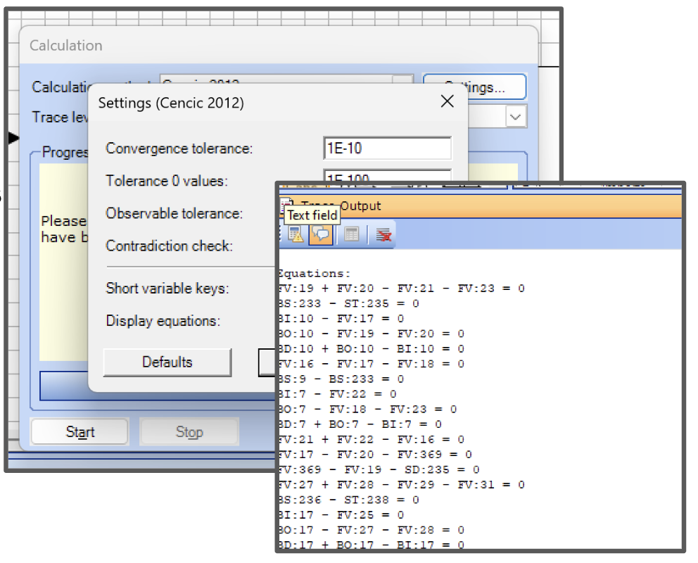
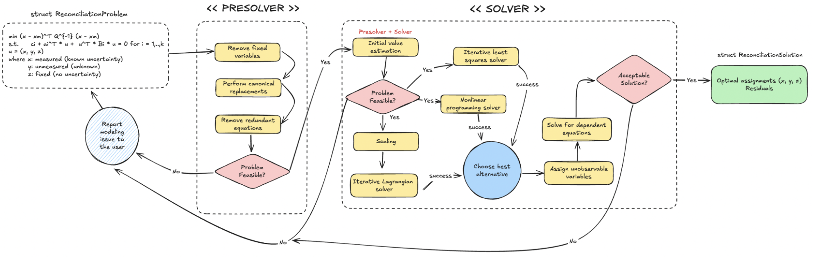

# OpenSEFA.jl

## Introduction

`OpenSEFA.jl` is a Julia package designed for modeling and solving **nonlinear data reconciliation problems** within the context of **Substance & Energy Flow Analysis (SeFA)** and **Material Flow Analysis (MFA)**. These methodologies serve as powerful decision-support tools across diverse fields, including but not limited to:

- **Environmental management**
- **Waste resource management**
- **Policy assessment**

The primary goal of MFA is to **quantify all flows and stocks** in a defined system, along with their associated uncertainties. For a comprehensive introduction to the theory and applications of MFA, refer to the standard handbook [1]. This project has been highly inspired by [STAN Software](https://www.stan2web.net/).

<p align="center">
    
</p>

## Development Workflow

- **Branch Strategy**: The `main` branch is reserved exclusively for production deployments. All pull requests for bug fixes, new features, and development work should target the `develop` branch.

- **Version Information:** The current release version is stored in the `Project.toml` file, and release updates are tracked in the `NEWS.md` file for easy reference.

- **Deployment Process:** Deployments to production are automated through our CI/CD pipeline when changes are merged to `main`. You can monitor deployment status through the pipeline output — a green checkmark typically indicates successful deployment.

## Key Features

- **Nonlinear optimization**: Solve data reconciliation problems with both linear and bilinear constraints.
- **Uncertainty quantification**: Integrates measured variable uncertainties directly into the optimization.
- **Customizable modeling**: Supports various types of variables and constraints to adapt to a wide range of MFA scenarios.
- **Efficient implementation**: Built on Julia for high performance in numerical computation.
- **HTTP API**: RESTful API for integration with external tools and web applications.
- **STAN compatibility**: Import and solve models from STAN software.

## Problem Formulation

This package addresses the following **nonlinear data reconciliation optimization problem**:

<p align="center">
    
</p>

### Problem Variables and Parameters

The mathematical formulation relies on the following definitions:

- **Measured variables** ($x$):
  Known variables with specified mean values ($x_m$) and uncertainties.
- **Unmeasured variables** ($y$):
  Unknown variables to be estimated through optimization.
- **Fixed variables** ($z$):
  Known variables without associated uncertainties.
- **Weights matrix** ($Q$):
  A diagonal matrix whose entries reflect the variances of the measured variables, encoding their uncertainties.
- **Constraints**:
  Each constraint $i \in \{1, \dots, k\}$ can be linear (where $B_i$ is the zero matrix) or nonlinear (bilinear in the variables).

### Problem Data

Each constraint is parameterized by:

- $c_i$: A scalar constant.
- $a_i$: A vector associated with the linear terms.
- $B_i$: A matrix for bilinear terms.

This formulation supports both linear and bilinear constraints, allowing for broad applicability to real-world MFA problems.

## Getting Started

To install this package, clone the repository then instantiate it [using the Julia package manager](https://julialang.github.io/Pkg.jl/v1/managing-packages/) by activating the `pkg` mode (type `]`, and to leave it, type `<backspace>`), followed by

```julia
$ julia --project

julia> ]
pkg> instantiate
```

This downloads and also precompiles all dependencies, so it may take a few minutes the first time it is run. (The command `instantiate` is only required once.)

## Quick Example

Solving a problem involves these steps:

- **Specification:**
  Loading the data with the model specification into the internal data reconciliation problem representation using Julia data structures (namely, `ReconciliationProblem`).

- **Solution:**
  Solving the reconciliation problem using default or custom algorithm choices, obtaining a solution (namely, `ReconciliationSolution`).

- **Validation:**
  Verifying the quality of the solution e.g. magnitude of residual terms, possibly going back to step (ii).

We summarize the steps below in a self-contained example that loads the model from article [2].

```julia
# Load the package.
using OpenSEFA

# Include the file containing the problem definition.
include(joinpath(pkgdir(OpenSEFA), "test", "examples", "seven_flows.jl"))

# Parse the equations and load into Julia data structures.
rec = seven_flows_cencic_2012()

# Solve the problem with the default algorithm choice.
sol = solve(rec)
```

If you printed `rec` and `sol` at the intermediate stages, you would see:

```julia
julia> rec
• Data reconciliation optimization problem with:
  • Name: Seven flows Cencic2016
  • Equations: 4
  • Variables: 8
    • Measured: 4
    • Unmeasured: 3
    • Fixed: 1


julia> sol
• Solution of data reconciliation optimization problem with:
  • Name: Seven flows Cencic2016
  • Equations: 4
  • Variables: 8
    • Measured: 4
    • Unmeasured: 3
    • Fixed: 1
  • Objective value: 0.2959
  • Equations discrepancy (max abs): 1.026e-9
  • Fixed variables discrepancy (max abs): 0.0
```

More complex models defined using the STAN software can be loaded as well. Make sure that you export to a `trace.txt` file the result obtained from the STAN interface (trace dialog, enable equations output). Once that file has been (manually) generated, we parse it and then solve the problem:

```julia
using OpenSEFA

# Location of the folder with the model definition.
path = joinpath(MODELS_PATH, "4_PVC Austria (1950-1994)")

# Parse the trace file, then convert to Julia data structures.
rec = convert(ReconciliationProblem, parse(STANTrace, path))

# Solve the problem with the default algorithm choice.
solve(rec)
```

This illustrates only the basics; for more advanced usage and algorithm choices refer to the sections below, code documentation, or the test suite.

## Test Suite

To run the test suite using the Julia package manager do simply: `] test` in a Julia session, with the `OpenSEFA` project environment activated.

Alternatively you can launch the tests from the terminal using:

```bash
$ julia --project test/runtests.jl
```

## Parsing from STAN Solver

The module `STANModule` contains two main methods to allow loading model data, both intermediate and final, produced by the [STAN MFA/SEFA solver](https://www.stan2web.net/) [3].

To load model data (`*.csv` files) exported from the data explorer, add the corresponding files under a `models/name/data` folder then use:

```julia
using OpenSEFA

path = joinpath(MODELS_PATH, "1a_Example")
sdata = load_stan_data(path)
```

This should load all available flows and variable specifications into a Julia data structure containing data frames, namely a `STANData` represented by the diagram below.

<p align="center">
    
</p>

To load variables and equations data exported from STAN for an assembled model, run the STAN solver making sure that the verbose option for printing equations is activated. Then, save all results from the trace console into a `trace.txt` file, as the diagram below shows.

<p align="center">
    
</p>

The following code loads the model into a Julia data structure containing equations and variables, namely a `ReconciliationProblem`.

```julia
using OpenSEFA

path = joinpath(MODELS_PATH, "1a_Example")
strace = parse(STANTrace, path)
rec = convert(ReconciliationProblem, strace)
```

## Presolve Interface

Both presolve and solve interfaces are shown in the diagram below. Use `presolve` in order to run the symbolic/numeric simplification routines in the given model. A mutating `presolve!` method is also available.

```julia
using OpenSEFA

include(joinpath(pkgdir(OpenSEFA), "test", "examples", "seven_flows.jl"))
rec = seven_flows_cencic_2012()

pre = presolve(rec)
```

This will apply precomputations to the given problem, potentially returning a smaller problem.

<p align="center">
    
</p>

## Solve Interface

The solution interface implemented via `solve` by default internally applies presolving. This is called the default solver (`DefaultSolver`). You can specify any solver strategy using the two-argument version `solve(::ReconciliationProblem, ::ReconciliationSolver)` which returns a `ReconciliationSolution`.

```julia
using OpenSEFA

include(joinpath(pkgdir(OpenSEFA), "test", "examples", "seven_flows.jl"))
rec = seven_flows_cencic_2012()

# Same as solve(rec).
sol = solve(rec, DefaultSolver())
```

The default solver will perform these steps:

- Apply presolve, using `NonlinearSolve` default polyalgorithm to find suitable starting values.
- Apply solve, using `Ipopt` NLP solver.
  - If it fails the starting values solution is used.
  - Otherwise, the candidate solution found by NLP is used.

For more exploratory cases, you may want to choose another solver backend supported by JuMP. For example, the following script solves the seven flows problem using [MadNLP](https://github.com/MadNLP/MadNLP.jl) solver (without presolving unless explicitly stated). The way we do so is we pass the optimization backend via the JuMP interface solver:

```julia
using OpenSEFA
using MadNLP

include(joinpath(pkgdir(OpenSEFA), "test", "examples", "seven_flows.jl"))
rec = seven_flows_cencic_2012()

sol = solve(rec, JuMPSolver(solver=MadNLP.Optimizer))
```

## Using the Solver via HTTP Requests

First you need to download Julia and install dependencies as explained previously.

1. Consider the example model file in JSON format in: `test/examples/seven_flows.json`.

2. Load the Julia backend and also load the server in the repository root:

```bash
$ julia --project -e "using OpenSEFA; start_server()"
```

If loading is performed correctly you should see a message similar to this:

```bash
% julia --project -e "using OpenSEFA; start_server()"
   ____                            
  / __ \_  ____  ______ ____  ____ 
 / / / / |/_/ / / / __ `/ _ \/ __ \
/ /_/ />  </ /_/ / /_/ /  __/ / / /
\____/_/|_|\__, /\__, /\___/_/ /_/ 
          /____//____/   

[ Info: Started server: http://0.0.0.0:8080
[ Info: Documentation: http://0.0.0.0:8080/docs
[ Info: Listening on: 0.0.0.0:8080, thread id: 1
```

### `health` endpoint

To have visibility into the server's operational status, a `health` `GET` endpoint is provided. This endpoint currently returns:

- Uptime statistics.
- Recent request processing times.

To use it, after starting the server do:

```bash
curl http://localhost:8080/health
```

It should return an output similar to:

```
% curl http://localhost:8080/health
{"uptime (seconds)":45.68,"requests":{"total":0,"max time (seconds)":0.0,"average time (seconds)":0.0}}%
```

### `solve` endpoint

Run the `curl` command to create a request to the server, passing the model formatted as JSON in the payload. This should run the model and return the result. Here is a full working example for the model from the file `test/examples/seven_flows.json`:

```bash
curl -X POST http://localhost:8080/solve -H "Content-Type: application/json" -d '{"content": {"name": "SEFMN Example", "variables": [{"name": "F1_mass_N1", "is_transfer_coefficient": false, "type": "MeasuredVariable", "value": 1, "uncertainty": 0.1}, {"name": "F2_mass_N1", "is_transfer_coefficient": false, "type": "UnmeasuredVariable"}, {"name": "F3_mass_N1", "is_transfer_coefficient": false, "type": "MeasuredVariable", "value": 2, "uncertainty": 0.3}], "equations": [{"constant_term": {"value": 0}, "linear_terms": [{"name": "F1_mass_N1", "factor": 1}, {"name": "F3_mass_N1", "factor": 1}, {"name": "F2_mass_N1", "factor": -1}], "bilinear_terms": []}], "solver": "JuMP"}}'
```

See the module docstring of `HTTPServerModule` for additional examples.

### Integration with OpenSEFA editor

OpenSEFA.jl can be integrated with the OpenSEFA editor. If you are interested in the editor source code, please [contact](mailto:contact@matplus.eu) [Matplus GmbH](https://www.matplus.eu/). A valid JointJS+ license must be held.

Create a `config.js` file in the OpenSEFA editor project root which will be included in the build result when running `npm run build`. The content should be:

```
window.__ENV__ = {
  EDA_HOST: "http://0.0.0.0:8080",
  SOLVER_TOKEN: ""
};
```

Adjust the `EDA_HOST` if appropriate based on the logs when starting the Julia server.

Then, follow these steps:

1. Start the HTTP server of the Julia backend.
2. Launch the model editor using `npm run dev`.
3. If the integration is working correctly, when clicking the `Solve` button it should perform HTTP requests to the Julia server and you can check the logs that it functions correctly.

## Documentation

### Online Documentation

The complete documentation is available at: **[matplusgmbh.github.io/opensefa-reconciliation-solver](https://matplusgmbh.github.io/opensefa-reconciliation-solver/stable/)**

It includes:
- Getting Started guide with installation and quick examples
- Comprehensive examples and use cases
- HTTP API reference
- Detailed API documentation for all modules and functions
- Academic references and citations

### Building Documentation Locally

To build and preview the documentation on your local machine:

#### Prerequisites

Ensure you have Julia installed (version 1.10 or later recommended).

#### Step 1: Navigate to the documentation directory

```bash
cd docs
```

#### Step 2: Install documentation dependencies

```bash
julia --project -e 'using Pkg; Pkg.instantiate()'
```

#### Step 3: Build the documentation

```bash
julia --project make.jl
```

#### Step 4: Preview the documentation

```bash
# On macOS
open build/index.html

# On Linux
xdg-open build/index.html

# On Windows
start build/index.html
```

For detailed troubleshooting, contributing guidelines, and documentation style guide, see the [Contributing](https://matplusgmbh.github.io/opensefa-reconciliation-solver/stable/contributing.html) page in the documentation.

## Benchmark

An evaluation for each model and comparison with reference solutions by STAN for different models are found in the `OpenSEFABenchmarks` package.

## Feedback and Contributions

We welcome contributions, feedback, and suggestions for improvement. Please contact the [Matplus GmbH](https://www.matplus.eu/).

## License

OpenSEFA.jl is publicly available under the [PolyForm Noncommercial License 1.0.0](https://polyformproject.org/licenses/noncommercial/1.0.0/). The full license text is in the [`LICENSE`](LICENSE) file.

You may use, modify, and share the software for **noncommercial purposes**, including research, education, and personal projects. **Commercial deployment or integration** requires separate arrangements with [Matplus GmbH](https://www.matplus.eu/).

The source code is publicly available for inspection, modification, and redistribution under the same license. Install the package by activating the project directory with Julia's package manager (`Pkg.develop` with the package directory).

Contributors license their contributions under PolyForm NC for public distribution and grant [Matplus GmbH](https://www.matplus.eu/) additional rights under the [Contributor License Agreement](CLA.md).

Third-party Julia dependencies retain their own licenses.

## References

[1] Brunner, Paul H., and Helmut Rechberger. _Handbook of material flow analysis: For environmental, resource, and waste engineers._ CRC press, 2016.

[2] Cencic, Oliver. _Nonlinear data reconciliation in material flow analysis with software STAN._ Sustainable Environment Research 26, no. 6 (2016): 291-298.

[3] STAN https://www.stan2web.net/ _STAN v2.6._ Software developed by researchers at the Research Unit of Waste and Resource Management at TU Wien, and inka software.
