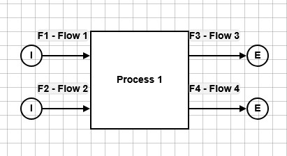

# [Solving strategies](@id solving_strategies_page)

This page provides information on the theoretical background of solving with OpenSEFA.jl.

## Presolving

The purpose of the presolving is to simplify the constraint equations in order to reduce the complexity of the reconciliation problem. The result of presolving (or a presolving step) is held in a `PresolvedReconciliationProblem`. All variable assignments/replacements done during presolving are unique.

The presolving consists of several steps:

### Removal of fixed variables

Fixed variables get replaced by their assigned values, i.e. they become constants in the constraint equations.

The removal of fixed variables is also part of other solvers if the problem hasn't been presolved before.

### Trivial and bilinear substitutions

A trivial substitution is applied to equations of the form $c - v = 0$ where $c$ is a constant and $v$ is a variable. The variable $v$ gets value $c$ assigned. For example, if we have the equation $5 - x = 0$, then $x$ gets assigned the value $5$. Furthermore, from an equation of the form $c - v^2 = 0$ a variable assignment is derived if the equation is uniquely solvable. For example, if we have the equation $9 - x^2 = 0$ and $x$ is non-negative (lower bound $0.0$ is imposed per default for most variables), then $x$ gets assigned the value $3$. (Without any bound on $x$, the variable gets not assigned here as it could be $+3$ or $-3$.)

Similarly, if there is an equation of the form $c - v * w = 0$ where $c$ is a constant and $v$ and $w$ are variables, the bilinear terms $v * w$ and $w * v$ get substituted by the value of $c$ in all the other equations. For example, if we have the equation $6 - x * y = 0$, then this equation is kept but $x * y$ and $y * x$ get replaced by the value $6$ in all the other equations.

Searching for equations that allow a trivial or bilinear substitution is repeated (taking into account previous substitutions) until no further equation of this form is found.

### Removal of redundant equations

Linear dependencies of equations are detected using the reduced row echelon form (rref) of the equations matrix. Equations that can be written as a linear combination of other equations are removed.

## JuMP Solver

The `JuMPSolver()` builds a JuMP model from the reconciliation problem and optimizes it using the JuMP framework (using Ipopt per default).

## Finding starting values

Finding starting values allows a warm start for the JuMP solver. The proposed starting values base on the measured values for the measured variables.

First, all measured variables get their mean value assigned. Then the constraint equations are used to find starting values for the unmeasured variables. If a constraint equation is violated after replacing measured variables by their mean, the equation is ignored while finding starting values. In particular, the starting values are not feasible values for the reconciliation problem anymore (i.e. cannot be used as final solution).

The resulting equations contain unmeasured variables only. The equation system is getting solved by using the internal presolving algorithm first and then, if necessary, using the `starting_values_solver` (being the `NonlinearSolver()` from NonlinearSolve.jl per default.)

## Default Solver

The `DefaultSolver()` combines presolving, searching for starting values (with `starting_values_solver`) and solving of the reduced reconciliation problem (with `optimization_solver`) into one solver.

## Postprocessing

### Error propagation

After a solution is found, the uncertainties of the variables are computed. Two options are available:

#### RREF-based error propagation

Per default, the uncertainties are computed in a similar way as STAN does (cf. [[C16]](@ref)):

Let $Q$ denote the variance-covariance matrix of the measured variables, i.e. $Q$ is a diagonal matrix with the squared uncertainties on the diagonal. The constraint equations get linearized, i.e. the jacobian matrix is computed at the solution values. For the jacobian, the variables are ordered such that the unmeasured variables are before the measured ones. In order to analyze the coupling, the jacobian is transformed into reduced row echelon form (rref). This rref matrix is written in a block matrix form $\begin{bmatrix} A_{cy} & A_{cx}\\ 0 & A_{rx}\end{bmatrix}$ where subscript $y$ and $x$ denote unmeasured and measured variables, respectively, and subscript $c$ denotes the rows with rows non-zero entries for unmeasured variables ($y$). The rows with subscript $r$ are the remaining non-trivial rows (dropping zero lines). The unmeasured variables $y$ are determined uniquely if and only if $A_{cy}$ is the identity matrix. Otherwise, all rows with more than one non-trivial entry in $A_{cy}$ as well as all zero columns of $A_{cy}$ are removed. This results in a reduced equation system for the uniquely determined unmeasured variables. The variance-covariance matrices for the measured and the unmeasured variables are computed by
```math
\begin{aligned}
\mathrm{Cov}(x) &= Q - Q A_{rx}^T \left(A_{rx} Q A_{rx}^T \right)^{-1} A_{rx} Q,\\
\mathrm{Cov}(y) &= A_{cx} * \mathrm{Cov}(x) * A_{cx}^T.
\end{aligned}
```
The uncertainties of the reconciled and uniquely solved unmeasured variables are the square roots of the diagonal entries of the variance-covariance matrices.

#### KKT-based error propagation

A mathematical generalization that is less numerically stable than the RREF-based method presented above is the following calculation approach:

##### Notation

Let

-  $x_m$ be the measurements,
-  $\hat{x}$ be the reconciled measured variables
-  $\Sigma$ be the covariance matrix of the measurements,
-  $\hat{y}$ be the unmeasured variables' solution
-  $c(x, y)$ be the constraint function satisfied at $c(x, y) = 0$ for any feasible solution $(x, y)$
-  $\lambda$ be the Lagrangian multipliers of the constraints at the optimal solution
-  $(x_{\text{true}}, y_{\text{true}})$ the (unknown) ground truth (satisfying $c(x_{\text{true}}, y_{\text{true}})=0$)

##### Reconciliation problem formulation

We consider the reconciliation problem:
```math
\min_{\substack{(x,y)\\ c(x,y)=0}} (x-x_m)^T \Sigma^{-1} (x-x_m)
```
In particular, we are interested in
```math
(\hat{x}, \hat{y}) = \argmin_{\substack{(x,y)\\ c(x,y)=0}} (x-x_m)^T \Sigma^{-1} (x-x_m)
```
Let $\mathrm{rec}$ be the function such that for every measurement $x_m$ we have $\mathrm{rec} \colon x_m \mapsto \mathrm{rec}(x_m) = (\mathrm{rec}_x(x_m), \mathrm{rec}_y(x_m)) = (\hat{x}, \hat{y})$. (The function $\mathrm{rec}$ is not necessarily well-defined (cf. non-uniqueness example)!)

The Lagrangian function of the minimization problem is
```math
\mathcal{L}(x, y, \lambda; x_m) = (x-x_m)^T \Sigma^{-1} (x-x_m) + \lambda c(x,y)
```

##### Uncertainties

The ground truth $(x_{\text{true}}, y_{\text{true}})$ is unknown. We know that $x_m \sim \mathcal{N}(x_{\text{true}}, \Sigma)$.

We would like to find the covariance matrices $\Sigma_{\hat{x}}$ and $\Sigma_{\hat{y}}$ such that $\hat{x} \sim \mathcal{N}(x_{\text{true}}, \Sigma_{\hat{x}})$ and $\hat{y} \sim \mathcal{N}(y_{\text{true}}, \Sigma_{\hat{y}})$.

##### Linearity assumption

First order Taylor expansion yields a linearity assumption, i.e., the following relationship:

```math
\mathrm{rec}(x_{\text{true}}) \approx \mathrm{rec}(x_m) + D\, \mathrm{rec}(x_m) \cdot (x_{\text{true}} - x_m)
```

Let

-  $D_x = D\, \mathrm{rec}_x (x_m)$
-  $D_y = D\, \mathrm{rec}_y (x_m)$

Using $\hat{x} = \mathrm{rec}_x(x_m)$ and $x_{\text{true}} = \mathrm{rec}_x(x_{\text{true}})$ we compute
```math
\Sigma_{\hat{x}} 
= \mathrm{Cov}(\hat{x}) 
= \mathbb{E}[(\hat{x}-x_{\text{true}})(\hat{x}-x_{\text{true}})^T] 
= \mathbb{E}[(\mathrm{rec}_x(x_m)-\mathrm{rec}_x(x_{\text{true}}))(\mathrm{rec}_x(x_m)-\mathrm{rec}_x(x_{\text{true}}))^T] 
\approx \mathbb{E}[(D_x (x_m-x_{\text{true}}))(D_x(x_m-x_{\text{true}}))^T] 
= \mathrm{Cov}(D_x x_m) 
= D_x \cdot \Sigma \cdot D_x^T
```
and on the other hand, using $\hat{y} = \mathrm{rec}_y(x_m)$ and $y_{\text{true}} = \mathrm{rec}_y(x_{\text{true}})$
```math
\Sigma_{\hat{y}} 
= \mathrm{Cov}(\hat{y}) 
= \mathbb{E}[(\hat{y}-y_{\text{true}})(\hat{y}-y_{\text{true}})^T] 
= \mathbb{E}[(\mathrm{rec}_y(x_m)-\mathrm{rec}_y(x_{\text{true}}))(\mathrm{rec}_y(x_m)-\mathrm{rec}_y(x_{\text{true}}))^T] 
\approx \mathbb{E}[(D_y (x_m-x_{\text{true}}))(D_y(x_m-x_{\text{true}}))^T] 
= \mathrm{Cov}(D_y x_m) 
= D_y \cdot \Sigma \cdot D_y^T.
```

##### Implicit differentiation

To find $D_x$ and $D_y$, we can use the implicit function theorem on the KKT optimality conditions. Any optimal solution $(\hat{x}, \hat{y}, \hat{\lambda}) = \mathrm{rec}(x_m)$ for given measurements $x_m$ satisfies the following conditions:

```math
\begin{aligned}
2 \cdot \Sigma^{-1} (\hat{x} - x_m) + J_x(\hat{x}, \hat{y})^T \cdot \hat{\lambda} = \nabla_x \mathcal{L}(\hat{x}, \hat{y}, \hat{\lambda}; x_m) & = 0 \\
J_y(\hat{x}, \hat{y})^T \cdot \hat{\lambda} = \nabla_y \mathcal{L}(\hat{x}, \hat{y}, \hat{\lambda}; x_m) & = 0 \\
c(\hat{x}, \hat{y}) = \nabla_{\lambda} \mathcal{L}(\hat{x}, \hat{y}, \hat{\lambda}; x_m) & = 0
\end{aligned}
```

where $J_x$ and $J_y$ are the Jacobians of the constraints $c(x, y)$ wrt $x$ and $y$ respectively. The KKT conditions can be written as follows:

```math
\begin{aligned}
F(\hat{x}, \hat{y}, \hat{\lambda}, x_m) & = \begin{bmatrix}
  2 \cdot \Sigma^{-1} \cdot (\hat{x} - x_m) + J_x(\hat{x}, \hat{y})^T \cdot \hat{\lambda} \\
  J_y(\hat{x}, \hat{y})^T \cdot \hat{\lambda} \\
  c(\hat{x}, \hat{y})
\end{bmatrix} = 0
\end{aligned}
```

Since the above equation is satisfied for any $x_m$ and the corresponding optimal $(\hat{x},\hat{y},\hat{\lambda})$, we can use the implicit function theorem:

```math
\begin{aligned}
\frac{\partial F}{\partial \hat{x}} \cdot \frac{d \hat{x}}{d x_m} + \frac{\partial F}{\partial \hat{y}} \cdot \frac{d \hat{y}}{d x_m} + \frac{\partial F}{\partial \hat{\lambda}} \cdot \frac{d \hat{\lambda}}{d x_m} + \frac{\partial F}{\partial x_m} & = 0
\end{aligned}
```

```math
\begin{aligned}
\frac{\partial F}{\partial \hat{x}} & = \begin{bmatrix}
  2 \cdot \Sigma^{-1} + H_{x,x}(\hat{\lambda}) \\
  H_{y,x}(\hat{\lambda}) \\
  J_x(\hat{x}, \hat{y})
\end{bmatrix} \\
\frac{\partial F}{\partial \hat{y}} & = \begin{bmatrix}
  H_{x,y}(\hat{\lambda}) \\
  H_{y,y}(\hat{\lambda}) \\
  J_y(\hat{x}, \hat{y})
\end{bmatrix} \\
\frac{\partial F}{\partial \hat{\lambda}} & = \begin{bmatrix}
J_x(\hat{x}, \hat{y})^T \\ J_y(\hat{x}, \hat{y})^T \\ 0
\end{bmatrix} \\
\frac{\partial F}{\partial x_m} & = \begin{bmatrix}
  -2 \cdot \Sigma^{-1} \\ 0 \\ 0
\end{bmatrix}
\end{aligned}
```

where $H = \begin{bmatrix} H_{x,x}(\hat{\lambda}) & H_{x,y}(\hat{\lambda}) \\ H_{y,x}(\hat{\lambda}) & H_{y,y}(\hat{\lambda}) \end{bmatrix}$ is the Hessian of $c(x, y)^T \cdot \hat{\lambda}$ wrt $\begin{bmatrix} x \\ y \end{bmatrix}$. Since $c(x, y)$ is bi-linear, $H$ is constant in $\begin{bmatrix} x \\ y \end{bmatrix}$ and is a linear function of $\hat{\lambda}$.

Writing the implicit function theorem in matrix-form:

```math
\begin{bmatrix}
  2\Sigma^{-1} + H_{x,x}(\hat{\lambda}) & H_{x,y}(\hat{\lambda}) & J_x(\hat{x}, \hat{y})^T \\
  H_{y,x}(\hat{\lambda}) & H_{y,y}(\hat{\lambda}) & J_y(\hat{x}, \hat{y})^T \\
  J_x(\hat{x}, \hat{y}) & J_y(\hat{x}, \hat{y}) & 0
\end{bmatrix} \cdot \begin{bmatrix}
  \frac{d \hat{x}}{d x_m} \\ \frac{d \hat{y}}{d x_m} \\ \frac{d \hat{\lambda}}{d x_m}
\end{bmatrix} = \begin{bmatrix}
  2\Sigma^{-1} \\ 0 \\ 0
\end{bmatrix}
```

Let the matrix of coefficients be $K$.

```math
K \cdot \begin{bmatrix}
  \frac{d \hat{x}}{d x_m} \\ \frac{d \hat{y}}{d x_m} \\ \frac{d \hat{\lambda}}{d x_m}
\end{bmatrix} = \begin{bmatrix}
  2\Sigma^{-1} \\ 0 \\ 0
\end{bmatrix}
```

```math
\begin{aligned}
D_x = \frac{d \hat{x}}{d x_m} & = 2 K^{\dagger}[(1:n_x), (1:n_x)] \cdot \Sigma^{-1} \\
D_y = \frac{d \hat{y}}{d x_m} & = 2 K^{\dagger}[((n_x+1):(n_x+n_y)), (1:n_x)] \cdot \Sigma^{-1}
\end{aligned}
```

The variance-covariance matrix of $\hat{x}$ and $\hat{y}$ are therefore given by:

```math
\begin{aligned}
\mathrm{Cov}(\hat{x}) & = D_x \cdot \Sigma \cdot D_x^T = 4 (K^{\dagger}[(1:n_x), (1:n_x)]) \cdot \Sigma^{-1} \cdot (K^{\dagger}[(1:n_x), (1:n_x)])^T \\
\mathrm{Cov}(\hat{y}) & = D_y \cdot \Sigma \cdot D_y^T = 4 (K^{\dagger}[(n_x+1):(n_x+n_y), (1:n_x)]) \cdot \Sigma^{-1} \cdot (K^{\dagger}[(n_x+1):(n_x+n_y), (1:n_x)])^T
\end{aligned}
```

### Identification of unobservable variables

Variables get labelled as 'unobservable' if they are unmeasured and there is not a unique value assignment for them. There are two ways of identifying a variable as unobservable:

#### Identification during presolve

When an unmeasured variable doesn't occur in any constraint equation (either a priori or after simplification of terms like $0 * v$ where $v$ is a variable), it is labelled as 'unobservable' and removed from the reconciliation problem while presolving.

#### Identification as postprocessing

Recall the [formulation of the reconciliation problem](@ref problem_formulation). Let $(x_*, y_*)$ be the minimizer returned by the solver. In the postprocessing it is checked if $y \mapsto D_y f(x_*, y)$ is invertible around $y = y_*$. Concretely, using the rref of the jacobian of the t equations linearized at $(x_*, y_*)$, it is checked which unmeasured variables are uniquely determined given $x = x_*$. Furthermore, all linearized equations (original ones and equations represented by the rref) get checked if they determine variables uniquely because of their variable bounds (e.g., for an equation $v + w = 0$ where $v$ and $w$ are variables with lower bound $0.0$). All unmeasured variables for which it cannot be proved that they are uniquely determined are labelled as 'unobservable'.

## Solution status

### Status codes

The following status codes exist:
- **FEASIBLE**: solving successfull, all variables have uniquely assigned value (no unobservable variables)
- **FEASIBLE\_WITH\_UNOBSERVABLE\_VARIABLES**: solving successfull, there are some variables which are unobservable
- **PARTIALLY\_FEASIBLE**: solving partially successfull (e.g. from calling Presolve) but not all variables could get solved or identified as unobservable
- **INFEASIBLE**: the solver was not able to find the solution
- **CONTRADICTORY**: the solver identified a contradiction, i.e. the problem is mathematically not solvable

### Evaluating residuals

Data to evaluate the quality of a solution is held in a `SolutionScore`. Besides information on the share of solved variables and equations, several scores on how well the solution values satisfy the constraint equations are stored.

The equation values are the values obtained by replacing every variable of an equation by the assigned values. Their absolute values are called absolute residuals.

The relative residual of an equation is $|r(x)| / (|c| + \|q\| \, \|x\| + \|P\| \, \|x\|^2)$ where:
-  $r(x)$ is the residual (signed equation value).
-  $c$ is the constant term.
-  $q$ are the linear term coefficients.
-  $P$ are the bilinear term coefficients. Note that the constraint equation does not define $P$ uniquely but only $P_{ij} + P_{ji}$ for indices $i$, $j$. Hence, $P$ is set such that for $i \neq j$ it holds either $P_{ij} = 0$ or $P_{ji} = 0$. (Different ways would be possible, e.g., defining $P$ to be symmetric instead.)
-  $\|x\|$ is the norm of all (uniquely determined) variables appearing in the equation. This ensures consistency as the same variable vector is used for both linear and bilinear contributions.

### Evaluating the status

The solution status is set during or after a solving process. 

If a contradiction was identified during presolving, the status is immediately set to `CONTRADICTORY` and not evaluated further.

After an optimization using JuMP (e.g. as part of the JuMPSolver or the DefaultSolver), the solution status is set tentatively depending on the `TerminationStatusCode` passed by JuMP to evaluate if the JuMP optimization was successfull. The status is set to `FEASIBLE` if JuMP returns `OPTIMAL`, `LOCALLY_SOLVED` or `ALMOST_LOCALLY_SOLVED`, and it is set to `INFEASIBLE` otherwise.

In the end of a solving process, the quality of a solution is evaluated again. If a contradiction was identified, the status keeps being set to `CONTRADICTORY`. If the JuMP solving was not successful (i.e. the status is already set `INFEASIBLE`), if the problem was an optimization or a feasibility problem (without objective function). If it is a nontrivial optimization problem, the status remains `INFEASIBLE` as it is not known if minimum was found. Otherwise, for feasibility problems or if the solving was successfull, the status is reset and evaluated by checking the residuals of the constraint equations: The solution is accepted if for every constraint equation the absolute residual is within the absolute tolerance or the relative residual is within the relative tolerance. Depending on the amount of (uniquely) solved variables and identified unobservable variables, the status is set `FEASIBLE`, `FEASIBLE_WITH_UNOBSERVABLE_VARIABLES` or `PARTIALLY_FEASIBLE`. If at least one constraint equation is not satisfied, the status is set to `INFEASIBLE`.

### Identification of contradictions

Contradictions within the underlying problem are identified while presolving. A contradiction is recognized (potentially after replacing or substituting variables) if...
- ...equations contain no variables and are not satisfied,
- ...a variable gets several assignments (that should be unique),
- ...the variable terms of an equation can be expressed as a linear combination of other equations but the constant terms don't fit,
- ...a variable is (uniquely) assigned to a value that violates the variable bounds.

After a contradiction is detected, the solving gets aborted.

## Uniqueness and globality

The non-linear data reconciliation problem is not convex in general.
This is an issue as the default OpenSEFA solver is only a local solver.
A SEFA model can result in a [reconciliation problem that has serveral local minima](@ref nonuniqueness_example), or in a reconciliation model with several local minima that are not all global.
Depending on the problem, the solver and the solver initialization (in particular the starting values), different local minima can be found and returned by the OpenSEFA solver.

For some reconciliation problems it can be proven that a local optimum is already global (e.g., if all constraint equations are linear or if there are no measured variables). This information is provided in the `is_global` field of a `ReconciliationSolution`.

### [Example with two global minima](@id nonuniqueness_example)

The reconciliation problem as formulated [here](@ref problem_formulation) is non-convex and can have several local minima. This is demonstrated with the following example.
Several slightly varying implementations of this example can be loaded from `uniqueness_1()`, `uniqueness_2()`, `uniqueness_3()` and `uniqueness_4()` in `OpenSEFA/test/solvers/jump_interface_module.jl`.



| Name     | Variable Type | Value  | Uncertainty | Lower bound | Upper bound |
|----------|---------------|--------|-------------|-------------|-------------|
| $F_1$    | Measured      | $1.0$  | $5/3$       | $0.0$       |             |
| $F_2$    | Measured      | $4/25$ | $5/4$       | $0.0$       |             |
| $F_3$    | Fixed         | $4/25$ |             |             |             |
| $F_4$    | Fixed         | $1.0$  |             |             |             |
| $t_{13}$ | Measured      | $1.0$  | $1.0$       | $0.0$       | $1.0$       |
| $t_{14}$ | Unmeasured    |        |             | $0.0$       | $1.0$       |
| $t_{23}$ | Unmeasured    |        |             | $0.0$       | $1.0$       |
| $t_{24}$ | Fixed         | $1.0$  |             |             |             |

For this system, the following constraint equations are generated:

```math
\begin{aligned}
	t_{13} + t_{14} &= 1,\\
	t_{23} + t_{24} &= 1,\\
	F_3 &= t_{13} F_1 + t_{23} F_2,\\
	F_4 &= t_{14} F_1 + t_{24} F_2.
\end{aligned}
```

From the constraint equations and the fixed variables we obtain the admissible set
```math
\begin{aligned}
	\mathcal{A} = \big\{ (F_1, F_2, t_{13}, t_{14}, t_{23}) \in \mathbb{R}^5 \ : \ &t_{13} + t_{14} = 1,\ t_{23} + 1= 1,\ \tfrac{4}{25} = t_{13} F_1 + t_{23} F_2,\ 1 = t_{14} F_1 + F_2, \\ & 0 \leq F_1,\ 0 \leq F_2,\ 0 \leq t_{13} \leq 1,\ 0 \leq t_{14} \leq 1,\ 0 \leq t_{23} \leq 1 \big\}.
\end{aligned}
```

As $t_{23} = 0$ and $t_{14} = 1 - t_{13}$ are uniquely determined by the other variables, it's equivalent to consider
```math
\begin{aligned}
	\tilde{\mathcal{A}} &= \left\{ (F_1, F_2, t_{13}) \in \mathbb{R}^3 \ : \ \tfrac{4}{25} = t_{13} F_1,\ 1 = (1 - t_{13}) F_1 + F_2,\ 0 \leq F_1,\ 0 \leq F_2,\ 0 \leq t_{13} \leq 1 \right\}\\
	&= \left\{ (F_1, F_2, t_{13}) \in \mathbb{R}^3 \ : \ \tfrac{4}{25} = t_{13} F_1,\ \tfrac{29}{25} = F_1 + F_2,\ 0 \leq F_1 \leq \tfrac{29}{25},\ 0 \leq t_{13} \leq 1 \right\}.
\end{aligned}
```

The variance-covariance matrix for the measured variables is
```math
Q = \begin{pmatrix}
		\tfrac{25}{9} & 0 & 0 \\
		0 & \tfrac{25}{16} & 0\\
		0 & 0 & 1
	\end{pmatrix}.
```
Therefore, the objective function for the reconciliation problem is
```math
\begin{pmatrix}
		F_1 - 1 & F_2 - \tfrac{4}{25} & t_{13} - 1
	\end{pmatrix} Q^{-1} \begin{pmatrix}
	F_1 - 1 \\ F_2 - \tfrac{4}{25} \\ t_{13} - 1
	\end{pmatrix}
	 = \frac{9}{25} (F_1 - 1)^2 + \frac{16}{25} (F_2 - \tfrac{4}{25})^2 + (t_{13} - 1)^2
```
and the resulting minimization problem is
```math
	\min_{(F_1, F_2, t_{13}) \in \tilde{\mathcal{A}}} \frac{9}{25} (F_1 - 1)^2 + \frac{16}{25} (F_2 - \tfrac{4}{25})^2 + (t_{13} - 1)^2.
```

Using the parametrization
```math
	\tilde{\mathcal{A}} = \left\{ (s, \tfrac{29}{25} - s, \tfrac{4}{25 s}) \ : \ \tfrac{4}{25} \leq s \leq \tfrac{29}{25} \right\},
```
the minimization problem becomes
```math
\begin{aligned}
	&\min_{\tfrac{4}{25} \leq s \leq \tfrac{29}{25}} \frac{9}{25} (s - 1)^2 + \frac{16}{25} (\tfrac{29}{25} - s - \tfrac{4}{25})^2 + (\tfrac{4}{25 s} - 1)^2 \notag\\
	= &\min_{\tfrac{4}{25} \leq s \leq \tfrac{29}{25}} (s-1)^2 + (\tfrac{4}{25 s} - 1)^2.
\end{aligned}
```
Minimization yields that the minimum is achieved for $s=\frac{1}{5}$ and $s=\frac{4}{5}$, i.e.,
```math
	(F_1, F_2, t_{13}, t_{14}, t_{23}) \in \{ (\tfrac{1}{5}, \tfrac{24}{25}, \tfrac{4}{5}, \tfrac{1}{5}, 0), \ (\tfrac{4}{5}, \tfrac{9}{25}, \tfrac{1}{5}, \tfrac{4}{5}, 0) \}
```
are both optimizers for the data reconciliation problem.